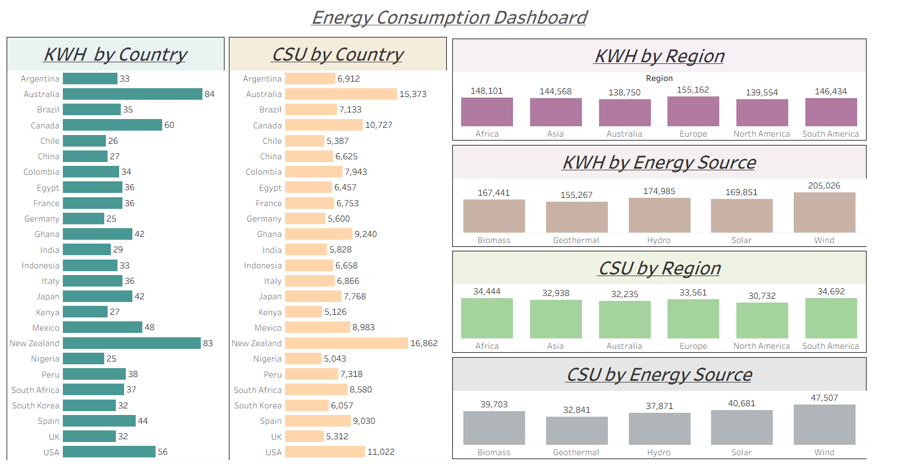

# Renewable Energy Consumption Analytics Dashboard

### Dashboard Link

[https://public.tableau.com/views/YOUR_TABLEAU_DASHBOARD_LINK](https://public.tableau.com/app/profile/adarsh.prajapati5912/viz/Book1_17660784718660/TableauDashboard)

---

# Problem Statement

This project analyzes renewable energy consumption patterns across different countries and regions. The goal is to understand how various renewable energy sources contribute to overall energy usage and how factors such as income levels influence energy consumption and cost savings.

The dashboard helps visualize energy usage trends and sustainability metrics to support better decision making in renewable energy adoption.

---

# Project Architecture

Dataset → AWS S3 → Snowflake Data Warehouse → SQL Transformation → Tableau Dashboard

---

# Tools & Technologies Used

* AWS S3 – Cloud storage for dataset
* Snowflake – Cloud data warehouse
* SQL – Data transformation and analysis
* Tableau Desktop – Data visualization
* Tableau Public – Dashboard publishing

---

# Data Pipeline Workflow

1. Renewable energy dataset uploaded to AWS S3.
2. Snowflake stage created to connect with S3 bucket.
3. Data loaded into Snowflake using COPY INTO command.
4. SQL queries used to transform and analyze energy consumption.
5. Processed dataset connected to Tableau for visualization.
6. Interactive dashboard created to analyze energy trends.

---

# Dashboard Preview

---

# Key Insights

### Energy Consumption by Region

Europe shows the highest renewable energy consumption compared to other regions.

### Energy Source Analysis

Wind energy contributes the largest share of renewable energy production.

### Country Level Consumption

Countries like Australia and New Zealand show high renewable energy usage.

### Income-Based Energy Consumption

Higher income households tend to consume more renewable energy but achieve higher cost savings through adoption.

---

# Dataset Features

The dataset includes:

* Country
* Region
* Energy Source
* Monthly Energy Usage (kWh)
* Household Size
* Income Level
* Urban or Rural Classification
* Subsidy Received
* Cost Savings (USD)

---

# Author

Adarsh Prajapati
B.Sc. (Hons) Computer Science – University of Delhi
